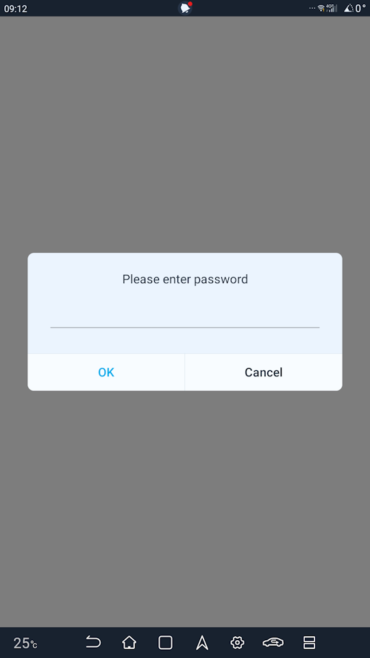
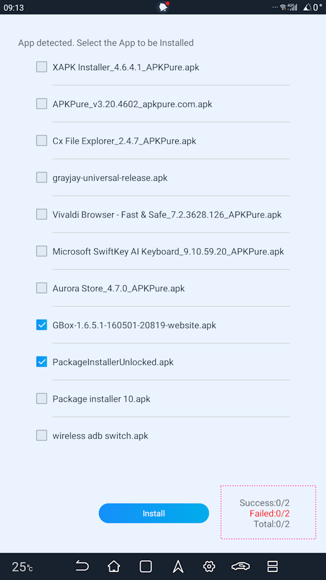

# BYD Seal 5 3rd-Party App Installation
Instructions on how to install non-market apps on your BYD Seal 5 DM-i system.  

  
DISCLAIMER

  
  ### WEBSITE DISCLAIMER
  The information provided by Rex Mag-uyon Torres ("we," "us," or "our") on https://github.com/rexmtorres/seal-5-3rd-party-app-installation (the "Site") is for general informational purposes only. All information on the Site is provided in good faith, however we make no representation or warranty of any kind, express or implied, regarding the accuracy, adequacy, validity, reliability, availability, or completeness of any information on the Site. UNDER NO CIRCUMSTANCE SHALL WE HAVE ANY LIABILITY TO YOU FOR ANY LOSS OR DAMAGE OF ANY KIND INCURRED AS A RESULT OF THE USE OF THE SITE OR RELIANCE ON ANY INFORMATION PROVIDED ON THE SITE. YOUR USE OF THE SITE AND YOUR RELIANCE ON ANY INFORMATION ON THE SITE IS SOLELY AT YOUR OWN RISK.

  ### EXTERNAL LINKS DISCLAIMER
  The Site may contain (or you may be sent through the Site) links to other websites or content belonging to or originating from third parties or links to websites and features in banners or other advertising. Such external links are not investigated, monitored, or checked for accuracy, adequacy, validity, reliability, availability, or completeness by us. WE DO NOT WARRANT, ENDORSE, GUARANTEE, OR ASSUME RESPONSIBILITY FOR THE ACCURACY OR RELIABILITY OF ANY INFORMATION OFFERED BY THIRD-PARTY WEBSITES LINKED THROUGH THE SITE OR ANY WEBSITE OR FEATURE LINKED IN ANY BANNER OR OTHER ADVERTISING. WE WILL NOT BE A PARTY TO OR IN ANY WAY BE RESPONSIBLE FOR MONITORING ANY TRANSACTION BETWEEN YOU AND THIRD-PARTY PROVIDERS OF PRODUCTS OR SERVICES.

&nbsp;

## Preface

Apart from installing apps through the BYD app marketplace, which offers an **extemely** limited (for now) set of apps, there are 2 unofficial ways of installing 3rd-party apps, which I will show you in this tutorial.  The 2 methods that will be shown here are, generally speaking, safe to follow.  However, as they are ***unofficial*** methods, they might affect your warranty.  So, follow at your own risk.  I take no responsibility, whatsoever, for any loss or damage incurred as a result of using and relying on the information on this tutorial.

Please also note that, depending on your infotainment system version, the steps mentioned here, to install apps, may or may not work.

&nbsp;

## Method 1: Sideloading

1. Prepare a USB flashdrive by formatting it to **FAT32** on a (Windows/Mac/Linux) computer.  Note that, especially when using Windows' built-in formatter, the FAT32 option may not appear if your flashdrive's capacity is greater than 32GB.  So you may want to use a smaller capacity flashdrive.

2. In your FAT32-formatted flashdrive, create a folder named "Third Party Apps 63" (without the quotes).
   
   *Note: This is specifically for the Philippine market.  If you're outside the Philippnes, replace "63" with your respective [country code](https://countrycode.org/philippines).*
   
   

3. Copy your downloaded APKs into the "Third Party Apps 63" folder.
   
   *Note: Be sure that you trust the source of your APKs.  One of the more popular sources of APKs is [APKPure](https://apkpure.com/).  Also note that APKPure provides 2 formats of an application package: APK and APKX.  Be sure to choose APK.  APKX is APKPure's own extension of the APK format and you will need an additional application manager to install it.*

4. Eject your flashdrive from your computer.

5. With your BYD Seal 5 off, plug your flashdrive into the USB data port (lower USB port) located underneath the center console.

6. Start your car and wait for the infotainment to initialize.

7. Once the system has initialized, you will be prompted to enter a password.  Enter "BYD6125F" (without quotes) and press OK.

   

8. You will then be able to see the list of the APKs you copied.  Tick the checkbox on the APKs you want to install and press Install. The "Success" counter at the bottom-right corner will indicate the number of apps successfully installed, while the "Failed" counter will indicate those that didn't install.  Failed installation can either mean that the APK you downloaded is corrupted, or that the BYD system does not support them.

   

9. After installing them, you can press Back or Home on the navigation bar and you should see the icon/s of the app/s you installed.

&nbsp;

## Method 2: Unlocked Package Manager
